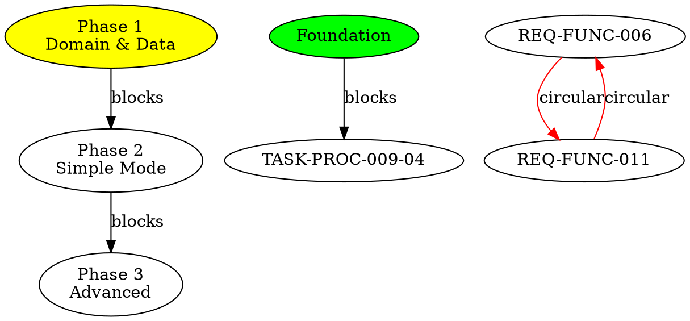
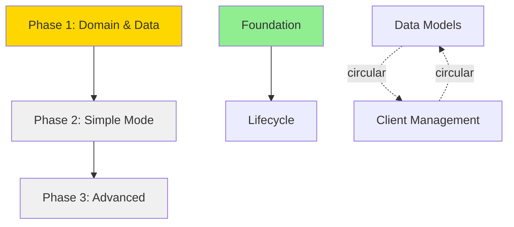
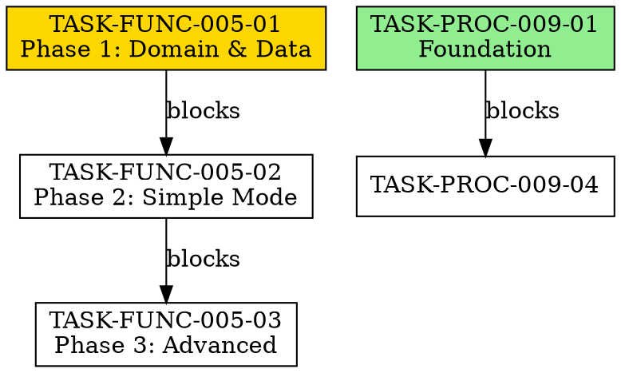

# Implementation Plan: Dependency Visualization for Status Overview Script

**Agent**: architecture-advisor
**Agent ID**: [To be logged via log-protocol]
**Date**: 2026-01-10
**Task**: TASK-PROC-009-04 (Enhancement: Dependency Visualization)
**Parent Plan**: 2026-01-09_01_plan_status_overview_script.md

---

## 1. Executive Summary

This plan extends the existing `generate_status_overview.py` script (1,451 lines) to add dependency visualization capabilities. The script already parses `depends_on`, `blocks`, `blocked_by` fields from YAML frontmatter - we need to transform this data into useful visual representations.

**Key Design Principles**:
- **Augment, don't redesign**: Add new visualization modes without disrupting existing functionality
- **Multiple perspectives**: Support both requirements and tasks dependency views
- **Text-based output**: ASCII art for terminal/markdown compatibility (Windows-friendly)
- **Optional graph export**: Support for external visualization tools (Graphviz DOT, Mermaid)
- **Circular dependency detection**: Identify and highlight problematic dependency loops
- **Critical path analysis**: Show which items block the most work

**User Value**:
- "Show how the requirements/task depend on each other"
- Understand blocking relationships at a glance
- Identify bottlenecks and critical paths
- Detect circular dependencies early
- Visualize project structure for planning

---

## 2. Current State Analysis

### 2.1 Existing Data Structures

**RequirementData** (lines 54-80):
```python
@dataclass
class RequirementData:
    # ... other fields ...
    depends_on: List[str]  # NOT CURRENTLY PARSED (missing from dataclass!)
    blocks: List[str]      # NOT CURRENTLY PARSED (missing from dataclass!)
```

**TaskData** (lines 84-122):
```python
@dataclass
class TaskData:
    # ... other fields ...
    depends_on: List[str] = field(default_factory=list)   # ✓ Already parsed (line 98)
    blocked_by: List[str] = field(default_factory=list)   # ✓ Already parsed (line 99)
```

**Gap Analysis**:
- ✅ Task dependencies: Fully supported
- ❌ Requirement dependencies: Fields exist in YAML but not parsed into dataclass
- ❌ Requirement `blocks` field: Not parsed
- ❌ Cross-references not validated (blocked_by vs blocks consistency)

### 2.2 Existing Dependency Usage

**BlockersReportGenerator** (lines 896-981):
- Shows tasks that are `blocked` (status or blocked_by list)
- Simple table format
- No visualization of dependency chains
- No upstream/downstream analysis

**Coverage Analysis** (lines 1116-1210):
- Shows task→requirement coverage
- This is a different type of relationship (implementation coverage, not dependencies)

---

## 3. Design: Dependency Visualization Modes

### 3.1 Integration Approach: Option A (Recommended)

**New Report Modes**:
- `--dependencies`: Dependency tree visualization (both tasks and requirements)
- `--dep-graph`: Graph export (DOT/Mermaid formats)
- `--critical-path`: Show items blocking the most work

**Why this approach**:
- Clean separation from existing modes
- Doesn't clutter existing reports
- Can be combined with filters (--category, --requirements)
- Clear user intent when requesting dependency info

**Alternative (Option B - Rejected)**: Add dependency sections to `--full` mode
- Reason: Full mode is already comprehensive, adding more would make it overwhelming

### 3.2 Visualization Format 1: Dependency Tree (ASCII Art)

**Output Example** (for `--dependencies` mode):

```markdown
# Dependency Tree - Tasks

## Active Dependencies

REQ-FUNC-005 (Plan Evaluation View)
├─ TASK-FUNC-005-01: Phase 1 - Domain & Data [in_progress]
│  └─ TASK-FUNC-005-02: Phase 2 - Simple Mode [pending] ⚠️ BLOCKED
│     └─ TASK-FUNC-005-03: Phase 3 - Advanced Features [pending] ⚠️ BLOCKED
│
REQ-PROC-009 (Requirements Structure)
├─ TASK-PROC-009-01: Foundation [completed] ✓
├─ TASK-PROC-009-04: Lifecycle (depends on TASK-PROC-009-01) [pending]
└─ TASK-PROC-009-02: Migration (depends on TASK-PROC-009-01) [pending]

## Orphaned Items (No Dependencies)

- TASK-NFUNC-004-01: Toast Component [in_progress]
- TASK-FUNC-007-01: Client Management [planned]

## Circular Dependencies Detected ⚠️

⚠️ CYCLE: REQ-FUNC-006 → REQ-FUNC-011 → REQ-FUNC-006
  - REQ-FUNC-006 depends on REQ-FUNC-011
  - REQ-FUNC-011 depends on REQ-FUNC-006
```

**With `--requirements` flag**:

```markdown
# Dependency Tree - Requirements

REQ-FUNC-006 (Data Models)
└─ REQ-FUNC-011 (Client Management) [depends on REQ-FUNC-006]
   └─ REQ-FUNC-008 (Plan Management) [depends on REQ-FUNC-011]

REQ-FUNC-005 (Plan Evaluation)
├─ REQ-NFUNC-004 (Context Help) [blocks: REQ-FUNC-005]
└─ REQ-NFUNC-005 (Skeleton Loader) [blocks: REQ-FUNC-005]
```

### 3.3 Visualization Format 2: Graph Export

**Graphviz DOT Format** (`--dep-graph --format dot`):



**Mermaid Format** (`--dep-graph --format mermaid`):



### 3.4 Visualization Format 3: Critical Path Analysis

**Output Example** (`--critical-path` mode):

```markdown
# Critical Path Analysis

## Most Blocking Items (items that block the most work)

| Item | Type | Blocks Count | Downstream Impact | Status |
|------|------|--------------|-------------------|--------|
| TASK-PROC-009-01 | impl | 3 direct, 8 total | 11 tasks | completed ✓ |
| REQ-FUNC-006 | requirement | 5 direct, 12 total | 17 items | in_progress |
| TASK-FUNC-005-01 | impl | 2 direct, 2 total | 2 tasks | in_progress ⚠️ |

## Longest Dependency Chains

**Chain 1 (depth: 4):**
REQ-FUNC-006 → REQ-FUNC-011 → TASK-FUNC-011-01 → TASK-FUNC-011-02

**Chain 2 (depth: 3):**
TASK-FUNC-005-01 → TASK-FUNC-005-02 → TASK-FUNC-005-03

## Bottleneck Warnings

⚠️ **TASK-FUNC-005-01** (in_progress) blocks 2 pending tasks
   - Consider prioritizing completion
   - Blocked tasks: TASK-FUNC-005-02, TASK-FUNC-005-03

⚠️ **REQ-FUNC-006** (in_progress) blocks 5 requirements
   - Critical path item
   - Blocked requirements: REQ-FUNC-011, REQ-FUNC-008, ...
```

---

## 4. Implementation Details

### 4.1 New Data Structures

```python
@dataclass
class DependencyNode:
    """Represents a node in the dependency graph."""
    id: str
    name: str
    type: str  # 'task' or 'requirement'
    status: str
    depends_on: List[str]  # IDs this item depends on
    blocks: List[str]      # IDs this item blocks (computed)
    depth: int = 0         # Distance from root in tree

    @property
    def is_root(self) -> bool:
        """Node with no dependencies."""
        return len(self.depends_on) == 0

    @property
    def is_leaf(self) -> bool:
        """Node that blocks nothing."""
        return len(self.blocks) == 0


@dataclass
class DependencyGraph:
    """Complete dependency graph with analysis."""
    nodes: Dict[str, DependencyNode]  # id -> node
    edges: List[Tuple[str, str]]      # (from_id, to_id) pairs

    # Analysis results
    circular_dependencies: List[List[str]]  # List of cycles
    orphaned_nodes: List[str]               # No dependencies at all
    critical_path: List[str]                # Longest chain
    blocking_scores: Dict[str, int]         # id -> count of downstream items

    def find_cycles(self) -> List[List[str]]:
        """Detect circular dependencies using DFS."""
        pass

    def compute_blocking_scores(self) -> Dict[str, int]:
        """Count how many items each node blocks (directly + indirectly)."""
        pass

    def find_longest_chain(self) -> List[str]:
        """Find the longest dependency chain."""
        pass

    def get_descendants(self, node_id: str) -> Set[str]:
        """Get all nodes that depend on this node (recursively)."""
        pass

    def get_ancestors(self, node_id: str) -> Set[str]:
        """Get all nodes this node depends on (recursively)."""
        pass


@dataclass
class DependencyAnalysis:
    """Analysis results for reporting."""
    graph: DependencyGraph
    root_nodes: List[DependencyNode]       # No dependencies
    leaf_nodes: List[DependencyNode]       # Block nothing
    blocking_rank: List[DependencyNode]    # Sorted by blocking_score
    longest_chains: List[List[str]]        # Top N longest chains
```

### 4.2 Graph Building Algorithm

```python
class DependencyGraphBuilder:
    """Builds dependency graph from requirements and tasks."""

    def __init__(self, requirements: List[RequirementData], tasks: List[TaskData]):
        self.requirements = requirements
        self.tasks = tasks

    def build(self, focus: str = 'tasks') -> DependencyGraph:
        """Build dependency graph.

        Args:
            focus: 'tasks' or 'requirements' or 'both'

        Returns:
            Complete dependency graph with analysis
        """
        nodes = {}
        edges = []

        if focus in ['tasks', 'both']:
            self._add_task_dependencies(nodes, edges)

        if focus in ['requirements', 'both']:
            self._add_requirement_dependencies(nodes, edges)

        # Build graph
        graph = DependencyGraph(nodes=nodes, edges=edges)

        # Run analysis
        graph.circular_dependencies = graph.find_cycles()
        graph.orphaned_nodes = [n.id for n in nodes.values() if n.is_root and n.is_leaf]
        graph.critical_path = graph.find_longest_chain()
        graph.blocking_scores = graph.compute_blocking_scores()

        return graph

    def _add_task_dependencies(self, nodes: Dict, edges: List):
        """Add task nodes and edges."""
        for task in self.tasks:
            # Create node
            node = DependencyNode(
                id=task.task_id,
                name=task.name,
                type='task',
                status=task.status,
                depends_on=task.depends_on,
                blocks=[]  # Computed later
            )
            nodes[task.task_id] = node

            # Add edges (this task → what it depends on)
            for dep_id in task.depends_on:
                edges.append((dep_id, task.task_id))

            # Add edges from blocked_by (inverse relationship)
            for blocker_id in task.blocked_by:
                edges.append((blocker_id, task.task_id))

        # Compute 'blocks' lists from edges
        for from_id, to_id in edges:
            if from_id in nodes:
                nodes[from_id].blocks.append(to_id)

    def _add_requirement_dependencies(self, nodes: Dict, edges: List):
        """Add requirement nodes and edges."""
        for req in self.requirements:
            node = DependencyNode(
                id=req.id,
                name=req.name,
                type='requirement',
                status=req.status,
                depends_on=req.depends_on,  # MUST BE ADDED TO RequirementData!
                blocks=req.blocks            # MUST BE ADDED TO RequirementData!
            )
            nodes[req.id] = node

            # Add edges
            for dep_id in req.depends_on:
                edges.append((dep_id, req.id))

            for blocked_id in req.blocks:
                edges.append((req.id, blocked_id))
```

### 4.3 Circular Dependency Detection (DFS)

```python
def find_cycles(self) -> List[List[str]]:
    """Detect circular dependencies using depth-first search.

    Why: Tarjan's algorithm for strongly connected components.
         More efficient than naive DFS for large graphs.
    Source: https://en.wikipedia.org/wiki/Tarjan%27s_strongly_connected_components_algorithm

    Returns:
        List of cycles (each cycle is a list of node IDs)
    """
    cycles = []
    visited = set()
    stack = []
    in_stack = set()

    def dfs(node_id: str, path: List[str]):
        if node_id in in_stack:
            # Found cycle
            cycle_start = path.index(node_id)
            cycle = path[cycle_start:] + [node_id]
            if len(cycle) > 1:  # Ignore self-loops
                cycles.append(cycle)
            return

        if node_id in visited:
            return

        visited.add(node_id)
        in_stack.add(node_id)
        stack.append(node_id)

        # Visit dependencies
        node = self.nodes.get(node_id)
        if node:
            for dep_id in node.depends_on:
                dfs(dep_id, path + [node_id])

        in_stack.remove(node_id)

    # Start DFS from each unvisited node
    for node_id in self.nodes:
        if node_id not in visited:
            dfs(node_id, [])

    return cycles
```

### 4.4 Critical Path Calculation

```python
def compute_blocking_scores(self) -> Dict[str, int]:
    """Count how many items each node blocks (recursively).

    Why: Identifies bottlenecks - items blocking the most downstream work.
         Uses memoization to avoid redundant traversals.

    Returns:
        Dict mapping node_id to count of all downstream dependencies
    """
    scores = {}
    memo = {}  # Memoization cache

    def count_descendants(node_id: str) -> int:
        if node_id in memo:
            return memo[node_id]

        node = self.nodes.get(node_id)
        if not node:
            return 0

        # Direct blocks + recursive descendants
        count = len(node.blocks)
        for blocked_id in node.blocks:
            count += count_descendants(blocked_id)

        memo[node_id] = count
        return count

    for node_id in self.nodes:
        scores[node_id] = count_descendants(node_id)

    return scores

def find_longest_chain(self) -> List[str]:
    """Find the longest dependency chain in the graph.

    Why: Identifies the critical path - longest sequence of dependencies.
         Useful for understanding minimum project completion time.

    Returns:
        List of node IDs representing the longest chain
    """
    longest = []

    def dfs_longest(node_id: str, path: List[str], visited: Set[str]):
        nonlocal longest

        if node_id in visited:
            return  # Avoid cycles

        visited.add(node_id)
        current_path = path + [node_id]

        node = self.nodes.get(node_id)
        if not node or len(node.blocks) == 0:
            # Leaf node - check if this is longest path
            if len(current_path) > len(longest):
                longest = current_path[:]
        else:
            # Continue DFS on blocked items
            for blocked_id in node.blocks:
                dfs_longest(blocked_id, current_path, visited.copy())

    # Start from root nodes (no dependencies)
    for node_id, node in self.nodes.items():
        if node.is_root:
            dfs_longest(node_id, [], set())

    return longest
```

---

## 5. Report Generator Implementation

### 5.1 DependencyTreeReportGenerator

```python
class DependencyTreeReportGenerator(ReportGeneratorBase):
    """Generates ASCII dependency tree visualization."""

    def __init__(self, requirements: List[RequirementData],
                 tasks: List[TaskData],
                 focus: str = 'tasks'):
        super().__init__(requirements, tasks, focus)
        self.builder = DependencyGraphBuilder(requirements, tasks)
        self.graph = self.builder.build(focus)

    def generate(self) -> str:
        """Generate dependency tree report."""
        lines = [f"# Dependency Tree - {self.focus.title()}", ""]
        lines.append(f"Generated: {datetime.now().strftime('%Y-%m-%d %H:%M')}")
        lines.append("")

        # Section 1: Active Dependencies (tree structure)
        lines.append("## Active Dependencies")
        lines.append("")
        lines.extend(self._render_tree())
        lines.append("")

        # Section 2: Orphaned Items
        if self.graph.orphaned_nodes:
            lines.append("## Orphaned Items (No Dependencies)")
            lines.append("")
            for node_id in self.graph.orphaned_nodes:
                node = self.graph.nodes[node_id]
                status_icon = self._get_status_icon(node.status)
                lines.append(f"- {node.id}: {node.name} [{node.status}] {status_icon}")
            lines.append("")

        # Section 3: Circular Dependencies
        if self.graph.circular_dependencies:
            lines.append("## Circular Dependencies Detected ⚠️")
            lines.append("")
            for cycle in self.graph.circular_dependencies:
                cycle_str = " → ".join(cycle)
                lines.append(f"⚠️ CYCLE: {cycle_str}")
                for i in range(len(cycle) - 1):
                    lines.append(f"  - {cycle[i]} depends on {cycle[i+1]}")
            lines.append("")

        return '\n'.join(lines)

    def _render_tree(self) -> List[str]:
        """Render dependency tree using ASCII art.

        Why: Uses box-drawing characters for clean tree structure.
             Handles both linear chains and branching dependencies.
        """
        lines = []

        # Group by parent requirement (for tasks) or by root nodes (for requirements)
        if self.focus == 'tasks':
            lines.extend(self._render_task_tree())
        else:
            lines.extend(self._render_requirement_tree())

        return lines

    def _render_task_tree(self) -> List[str]:
        """Render tasks grouped by parent requirement."""
        lines = []

        # Group tasks by parent requirement
        by_requirement = {}
        for task in self.tasks:
            if task.status in ['completed', 'cancelled']:
                continue  # Skip completed tasks

            req_id = task.parent_requirement
            if req_id not in by_requirement:
                by_requirement[req_id] = []
            by_requirement[req_id].append(task)

        # Render each requirement's tasks
        for req_id in sorted(by_requirement.keys()):
            # Find requirement name
            req = next((r for r in self.requirements if r.id == req_id), None)
            req_name = req.name if req else "Unknown"

            lines.append(f"{req_id} ({req_name})")

            tasks = by_requirement[req_id]
            for i, task in enumerate(tasks):
                is_last = (i == len(tasks) - 1)
                prefix = "└─" if is_last else "├─"
                status_icon = self._get_status_icon(task.status)
                blocked_warning = " ⚠️ BLOCKED" if task.is_blocked else ""

                lines.append(f"{prefix} {task.task_id}: {task.name} [{task.status}] {status_icon}{blocked_warning}")

                # Show dependencies
                if task.depends_on:
                    dep_prefix = "   " if is_last else "│  "
                    deps_str = ", ".join(task.depends_on)
                    lines.append(f"{dep_prefix}(depends on: {deps_str})")

            lines.append("")  # Blank line between requirements

        return lines

    def _render_requirement_tree(self) -> List[str]:
        """Render requirements as dependency tree."""
        lines = []
        visited = set()

        # Start from root nodes (no dependencies)
        roots = [n for n in self.graph.nodes.values() if n.is_root and n.type == 'requirement']

        for root in roots:
            lines.extend(self._render_subtree(root.id, 0, visited, is_last=True))
            lines.append("")

        return lines

    def _render_subtree(self, node_id: str, depth: int, visited: Set[str], is_last: bool) -> List[str]:
        """Recursively render dependency subtree.

        Args:
            node_id: Current node
            depth: Indentation depth
            visited: Set of already rendered nodes (avoid cycles)
            is_last: Whether this is the last child of parent
        """
        lines = []

        if node_id in visited:
            return [f"{'  ' * depth}(already shown: {node_id})"]

        visited.add(node_id)
        node = self.graph.nodes.get(node_id)
        if not node:
            return [f"{'  ' * depth}(missing: {node_id})"]

        # Render current node
        indent = "  " * depth
        prefix = "└─" if is_last else "├─"
        status_icon = self._get_status_icon(node.status)

        if depth == 0:
            lines.append(f"{node.id} ({node.name}) [{node.status}] {status_icon}")
        else:
            lines.append(f"{indent}{prefix} {node.id} ({node.name}) [{node.status}] {status_icon}")

        # Render blocked items (children)
        if node.blocks:
            for i, blocked_id in enumerate(node.blocks):
                child_is_last = (i == len(node.blocks) - 1)
                lines.extend(self._render_subtree(blocked_id, depth + 1, visited, child_is_last))

        return lines

    def _get_status_icon(self, status: str) -> str:
        """Get emoji icon for status."""
        icons = {
            'completed': '✓',
            'in_progress': '⏳',
            'pending': '⏸️',
            'blocked': '🚫',
            'cancelled': '❌'
        }
        return icons.get(status, '')
```

### 5.2 CriticalPathReportGenerator

```python
class CriticalPathReportGenerator(ReportGeneratorBase):
    """Generates critical path analysis report."""

    def __init__(self, requirements: List[RequirementData],
                 tasks: List[TaskData],
                 focus: str = 'tasks'):
        super().__init__(requirements, tasks, focus)
        self.builder = DependencyGraphBuilder(requirements, tasks)
        self.graph = self.builder.build(focus)

    def generate(self) -> str:
        """Generate critical path report."""
        lines = ["# Critical Path Analysis", ""]
        lines.append(f"Generated: {datetime.now().strftime('%Y-%m-%d %H:%M')}")
        lines.append("")

        # Section 1: Most Blocking Items
        lines.append("## Most Blocking Items (items that block the most work)")
        lines.append("")
        lines.append("| Item | Type | Blocks Count | Downstream Impact | Status |")
        lines.append("|------|------|--------------|-------------------|--------|")

        # Sort by blocking score
        sorted_nodes = sorted(
            self.graph.nodes.values(),
            key=lambda n: self.graph.blocking_scores.get(n.id, 0),
            reverse=True
        )

        for node in sorted_nodes[:10]:  # Top 10
            direct_blocks = len(node.blocks)
            total_impact = self.graph.blocking_scores.get(node.id, 0)
            status_icon = self._get_status_icon(node.status)

            lines.append(
                f"| {node.id} | {node.type} | "
                f"{direct_blocks} direct, {total_impact} total | "
                f"{total_impact} items | {node.status} {status_icon} |"
            )

        lines.append("")

        # Section 2: Longest Dependency Chains
        lines.append("## Longest Dependency Chains")
        lines.append("")

        longest = self.graph.critical_path
        if longest:
            chain_str = " → ".join(longest)
            lines.append(f"**Critical Path (depth: {len(longest)}):**")
            lines.append(chain_str)
        else:
            lines.append("*No dependency chains found*")

        lines.append("")

        # Section 3: Bottleneck Warnings
        lines.append("## Bottleneck Warnings")
        lines.append("")

        # Find in-progress items blocking multiple items
        bottlenecks = [
            n for n in sorted_nodes
            if n.status == 'in_progress' and len(n.blocks) > 0
        ]

        if bottlenecks:
            for node in bottlenecks[:5]:  # Top 5
                blocked_items = ", ".join(node.blocks[:3])  # Show first 3
                if len(node.blocks) > 3:
                    blocked_items += f", ... ({len(node.blocks) - 3} more)"

                lines.append(f"⚠️ **{node.id}** ({node.status}) blocks {len(node.blocks)} items")
                lines.append(f"   - Consider prioritizing completion")
                lines.append(f"   - Blocked items: {blocked_items}")
                lines.append("")
        else:
            lines.append("*No bottlenecks detected* ✓")

        return '\n'.join(lines)
```

### 5.3 DependencyGraphExporter

```python
class DependencyGraphExporter:
    """Exports dependency graph to external formats."""

    def __init__(self, graph: DependencyGraph):
        self.graph = graph

    def export_dot(self) -> str:
        """Export to Graphviz DOT format.

        Why: DOT format for generating SVG/PNG visualizations with Graphviz.
             Color-codes nodes by status, highlights circular dependencies.
        """
        lines = ["digraph dependencies {"]
        lines.append("    rankdir=TB;")
        lines.append("    node [shape=box];")
        lines.append("")

        # Add nodes
        lines.append("    // Nodes")
        for node_id, node in self.graph.nodes.items():
            color = self._get_dot_color(node.status)
            label = f"{node.id}\\n{node.name[:20]}"
            lines.append(f'    "{node_id}" [label="{label}" fillcolor={color} style=filled];')

        lines.append("")
        lines.append("    // Edges")

        # Add edges
        circular_edges = set()
        for cycle in self.graph.circular_dependencies:
            for i in range(len(cycle) - 1):
                circular_edges.add((cycle[i], cycle[i+1]))

        for from_id, to_id in self.graph.edges:
            is_circular = (from_id, to_id) in circular_edges
            color = "red" if is_circular else "black"
            label = "circular" if is_circular else "blocks"
            lines.append(f'    "{from_id}" -> "{to_id}" [color={color} label="{label}"];')

        lines.append("}")
        return '\n'.join(lines)

    def export_mermaid(self) -> str:
        """Export to Mermaid diagram format.

        Why: Mermaid for embedding in markdown/documentation.
             Renders directly in GitHub, GitLab, and many markdown viewers.
        """
        lines = ["graph TB"]

        # Add nodes with styling
        for node_id, node in self.graph.nodes.items():
            safe_id = node_id.replace('-', '_')
            label = f"{node.id}: {node.name[:20]}"
            style_class = self._get_mermaid_class(node.status)
            lines.append(f'    {safe_id}["{label}"]:::{style_class}')

        # Add edges
        circular_edges = set()
        for cycle in self.graph.circular_dependencies:
            for i in range(len(cycle) - 1):
                circular_edges.add((cycle[i], cycle[i+1]))

        for from_id, to_id in self.graph.edges:
            safe_from = from_id.replace('-', '_')
            safe_to = to_id.replace('-', '_')

            is_circular = (from_id, to_id) in circular_edges
            if is_circular:
                lines.append(f'    {safe_from} -.->|circular| {safe_to}')
            else:
                lines.append(f'    {safe_from} --> {safe_to}')

        # Add style definitions
        lines.append("")
        lines.append("    classDef inprogress fill:#ffd700")
        lines.append("    classDef pending fill:#f0f0f0")
        lines.append("    classDef completed fill:#90ee90")
        lines.append("    classDef blocked fill:#ff6b6b")
        lines.append("    classDef cancelled fill:#d3d3d3")

        return '\n'.join(lines)

    def _get_dot_color(self, status: str) -> str:
        """Get Graphviz color for status."""
        colors = {
            'completed': 'lightgreen',
            'in_progress': 'gold',
            'pending': 'white',
            'blocked': 'lightcoral',
            'cancelled': 'lightgray'
        }
        return colors.get(status, 'white')

    def _get_mermaid_class(self, status: str) -> str:
        """Get Mermaid CSS class for status."""
        classes = {
            'completed': 'completed',
            'in_progress': 'inprogress',
            'pending': 'pending',
            'blocked': 'blocked',
            'cancelled': 'cancelled'
        }
        return classes.get(status, 'pending')
```

---

## 6. Data Model Updates

### 6.1 RequirementData Extension

**CRITICAL**: Add missing fields to RequirementData

```python
@dataclass
class RequirementData:
    """Represents a requirement with all metadata."""
    id: str
    path: str
    name: str
    category: str
    status: str
    urgency: int
    urgency_reason: str
    impact: int
    impact_reason: str
    effort: str
    created: str
    updated: Optional[str]
    trackable_items: Dict[str, List[str]]
    has_frontmatter: bool

    # NEW FIELDS (must be parsed from YAML frontmatter)
    depends_on: List[str] = field(default_factory=list)  # ← ADD THIS
    blocks: List[str] = field(default_factory=list)      # ← ADD THIS

    @property
    def priority_score(self) -> int:
        return (self.urgency * 10) + self.impact
```

### 6.2 Parsing Updates

**Update `_requirement_from_frontmatter()` in StatusScanner**:

```python
def _requirement_from_frontmatter(self, path: Path, meta: Dict[str, Any]) -> RequirementData:
    """Create RequirementData from YAML frontmatter."""
    # ... existing code ...

    # NEW: Parse depends_on and blocks
    depends_on = meta.get('depends_on', [])
    if not isinstance(depends_on, list):
        depends_on = [depends_on] if depends_on else []

    blocks = meta.get('blocks', [])
    if not isinstance(blocks, list):
        blocks = [blocks] if blocks else []

    return RequirementData(
        # ... existing fields ...
        depends_on=depends_on,  # ← ADD THIS
        blocks=blocks,          # ← ADD THIS
        has_frontmatter=True
    )
```

---

## 7. Command-Line Interface Updates

### 7.1 New Arguments

```python
def parse_arguments():
    """Parse command-line arguments."""
    parser = argparse.ArgumentParser(...)

    # Existing mode group
    mode_group = parser.add_mutually_exclusive_group()
    mode_group.add_argument('--summary', ...)
    mode_group.add_argument('--priority', ...)
    mode_group.add_argument('--coverage', ...)
    mode_group.add_argument('--blockers', ...)
    mode_group.add_argument('--sprint', ...)
    mode_group.add_argument('--full', ...)

    # NEW DEPENDENCY MODES
    mode_group.add_argument('--dependencies', action='store_true',
                           help='Dependency tree visualization (ASCII art)')
    mode_group.add_argument('--dep-graph', action='store_true',
                           help='Export dependency graph (DOT/Mermaid format)')
    mode_group.add_argument('--critical-path', action='store_true',
                           help='Critical path analysis (bottlenecks and chains)')

    # Graph export format (only used with --dep-graph)
    parser.add_argument('--graph-format', choices=['dot', 'mermaid'],
                       default='dot',
                       help='Graph export format (default: dot)')

    # ... existing arguments ...

    return args
```

### 7.2 Main Orchestrator Updates

```python
def main():
    """Main entry point."""
    args = parse_arguments()

    # ... existing scanning code ...

    # Generate report
    print("\nGenerating report...")

    if args.summary:
        # ... existing code ...
    elif args.dependencies:
        # NEW
        generator = DependencyTreeReportGenerator(requirements, tasks, focus)
        report = generator.generate()
    elif args.dep_graph:
        # NEW
        builder = DependencyGraphBuilder(requirements, tasks)
        graph = builder.build(focus)
        exporter = DependencyGraphExporter(graph)

        if args.graph_format == 'mermaid':
            report = exporter.export_mermaid()
        else:
            report = exporter.export_dot()
    elif args.critical_path:
        # NEW
        generator = CriticalPathReportGenerator(requirements, tasks, focus)
        report = generator.generate()
    else:
        # ... existing modes ...

    # ... existing output code ...
```

---

## 8. Edge Cases & Error Handling

### 8.1 Missing References

```python
def _validate_references(self, nodes: Dict[str, DependencyNode]) -> List[str]:
    """Validate that all dependency references exist.

    Returns:
        List of warning messages for missing references
    """
    warnings = []

    for node_id, node in nodes.items():
        # Check depends_on references
        for dep_id in node.depends_on:
            if dep_id not in nodes:
                warnings.append(
                    f"⚠️ {node_id} depends on non-existent item: {dep_id}"
                )

        # Check blocks references
        for blocked_id in node.blocks:
            if blocked_id not in nodes:
                warnings.append(
                    f"⚠️ {node_id} blocks non-existent item: {blocked_id}"
                )

    return warnings
```

### 8.2 Self-Loops

```python
def _detect_self_loops(self, nodes: Dict[str, DependencyNode]) -> List[str]:
    """Detect items that depend on themselves."""
    self_loops = []

    for node_id, node in nodes.items():
        if node_id in node.depends_on:
            self_loops.append(node_id)

    return self_loops
```

### 8.3 Cross-Category Dependencies

```python
def _find_cross_category_deps(self) -> List[Tuple[str, str, str, str]]:
    """Find dependencies that cross category boundaries.

    Returns:
        List of (from_id, from_category, to_id, to_category) tuples
    """
    cross_category = []

    for node_id, node in self.graph.nodes.items():
        from_category = self._get_category(node_id)

        for dep_id in node.depends_on:
            to_category = self._get_category(dep_id)

            if from_category != to_category:
                cross_category.append((node_id, from_category, dep_id, to_category))

    return cross_category

def _get_category(self, item_id: str) -> str:
    """Extract category from ID (REQ-FUNC-001 → FUNC)."""
    parts = item_id.split('-')
    if len(parts) >= 2:
        return parts[1]
    return 'UNKNOWN'
```

---

## 9. Output Examples

### 9.1 Example: --dependencies (Tasks)

```markdown
# Dependency Tree - Tasks

Generated: 2026-01-10 15:30

## Active Dependencies

REQ-FUNC-005 (Plan Evaluation View)
├─ TASK-FUNC-005-01: Phase 1 - Domain & Data [in_progress] ⏳
│  └─ TASK-FUNC-005-02: Phase 2 - Simple Mode [pending] ⏸️ ⚠️ BLOCKED
│     (depends on: TASK-FUNC-005-01)
│     └─ TASK-FUNC-005-03: Phase 3 - Advanced Features [pending] ⏸️ ⚠️ BLOCKED
│        (depends on: TASK-FUNC-005-02)

REQ-PROC-009 (Requirements Structure)
├─ TASK-PROC-009-01: Foundation [completed] ✓
├─ TASK-PROC-009-04: Lifecycle [pending] ⏸️
│  (depends on: TASK-PROC-009-01)
└─ TASK-PROC-009-02: Migration [pending] ⏸️
   (depends on: TASK-PROC-009-01)

## Orphaned Items (No Dependencies)

- TASK-NFUNC-004-01: Toast Component [in_progress] ⏳
- TASK-FUNC-007-01: Client Management [planned] ⏸️

## Warnings

⚠️ TASK-FUNC-005-04 depends on non-existent item: TASK-FUNC-999-01
⚠️ Cross-category dependency: TASK-FUNC-005-03 (FUNC) depends on TASK-NFUNC-004-02 (NFUNC)
```

### 9.2 Example: --dependencies --requirements

```markdown
# Dependency Tree - Requirements

Generated: 2026-01-10 15:30

## Active Dependencies

REQ-FUNC-006 (Data Models) [in_progress] ⏳
└─ REQ-FUNC-011 (Client Management) [planned] ⏸️
   └─ REQ-FUNC-008 (Plan Management) [planned] ⏸️

REQ-FUNC-005 (Plan Evaluation) [in_progress] ⏳
├─ REQ-NFUNC-004 (Context Help) [planned] ⏸️
└─ REQ-NFUNC-005 (Skeleton Loader) [planned] ⏸️

## Orphaned Items (No Dependencies)

- REQ-PROC-001: Project Setup [implemented] ✓
- REQ-NFUNC-006: Testing Framework [implemented] ✓

## Circular Dependencies Detected ⚠️

⚠️ CYCLE: REQ-FUNC-006 → REQ-FUNC-011 → REQ-FUNC-006
  - REQ-FUNC-006 depends on REQ-FUNC-011
  - REQ-FUNC-011 depends on REQ-FUNC-006
```

### 9.3 Example: --critical-path

```markdown
# Critical Path Analysis

Generated: 2026-01-10 15:30

## Most Blocking Items (items that block the most work)

| Item | Type | Blocks Count | Downstream Impact | Status |
|------|------|--------------|-------------------|--------|
| TASK-PROC-009-01 | impl | 2 direct, 3 total | 3 tasks | completed ✓ |
| TASK-FUNC-005-01 | impl | 1 direct, 2 total | 2 tasks | in_progress ⏳ |
| REQ-FUNC-006 | requirement | 3 direct, 8 total | 8 items | in_progress ⏳ |

## Longest Dependency Chains

**Critical Path (depth: 4):**
TASK-FUNC-005-01 → TASK-FUNC-005-02 → TASK-FUNC-005-03 → TASK-FUNC-005-04

## Bottleneck Warnings

⚠️ **TASK-FUNC-005-01** (in_progress) blocks 2 items
   - Consider prioritizing completion
   - Blocked items: TASK-FUNC-005-02, TASK-FUNC-005-03

⚠️ **REQ-FUNC-006** (in_progress) blocks 3 requirements
   - Critical path item
   - Blocked items: REQ-FUNC-011, REQ-FUNC-008, REQ-FUNC-007
```

### 9.4 Example: --dep-graph --graph-format dot



---

## 10. Testing Strategy

### 10.1 Unit Tests

```python
# tests/test_dependency_graph.py

def test_cycle_detection():
    """Test circular dependency detection."""
    # Create test graph with cycle: A → B → C → A
    nodes = {
        'A': DependencyNode(id='A', depends_on=['C'], blocks=['B'], ...),
        'B': DependencyNode(id='B', depends_on=['A'], blocks=['C'], ...),
        'C': DependencyNode(id='C', depends_on=['B'], blocks=['A'], ...),
    }
    graph = DependencyGraph(nodes=nodes, edges=[('A','B'), ('B','C'), ('C','A')])

    cycles = graph.find_cycles()
    assert len(cycles) == 1
    assert 'A' in cycles[0] and 'B' in cycles[0] and 'C' in cycles[0]

def test_blocking_score_calculation():
    """Test recursive blocking score computation."""
    # A blocks B, B blocks C and D
    # A's score should be 3 (B, C, D)
    # B's score should be 2 (C, D)
    nodes = {
        'A': DependencyNode(id='A', depends_on=[], blocks=['B'], ...),
        'B': DependencyNode(id='B', depends_on=['A'], blocks=['C', 'D'], ...),
        'C': DependencyNode(id='C', depends_on=['B'], blocks=[], ...),
        'D': DependencyNode(id='D', depends_on=['B'], blocks=[], ...),
    }
    graph = DependencyGraph(nodes=nodes, edges=[...])

    scores = graph.compute_blocking_scores()
    assert scores['A'] == 3
    assert scores['B'] == 2
    assert scores['C'] == 0
    assert scores['D'] == 0

def test_longest_chain():
    """Test critical path calculation."""
    # Chain: A → B → C → D (length 4)
    nodes = {...}
    graph = DependencyGraph(nodes=nodes, edges=[...])

    chain = graph.find_longest_chain()
    assert len(chain) == 4
    assert chain == ['A', 'B', 'C', 'D']
```

### 10.2 Integration Tests

**Test Data**:
- Use existing requirements with real dependency data
- Create test fixtures with known circular dependencies
- Test with empty graphs (no dependencies)

**Test Scenarios**:
1. Run `--dependencies` on real data
2. Run `--dependencies --requirements` on real data
3. Run `--critical-path` on real data
4. Run `--dep-graph --graph-format dot` and validate DOT syntax
5. Run `--dep-graph --graph-format mermaid` and validate Mermaid syntax
6. Test with `--category FUNC` filter
7. Test warning messages for missing references

### 10.3 Manual Validation

**Visual Inspection**:
- [ ] Dependency tree renders correctly (box-drawing characters)
- [ ] Circular dependencies are highlighted
- [ ] Status icons display correctly (✓, ⏳, ⚠️, etc.)
- [ ] Orphaned items are listed
- [ ] Critical path makes logical sense
- [ ] DOT file opens in Graphviz without errors
- [ ] Mermaid diagram renders in GitHub markdown preview

**Windows Compatibility**:
- [ ] Box-drawing characters display correctly in Windows Terminal
- [ ] Unicode emoji display correctly (or graceful fallback)
- [ ] Path handling works on Windows

---

## 11. Implementation Effort & Complexity

### 11.1 File Changes

**Modified Files**:
1. `scripts/generate_status_overview.py` (~1,451 → ~2,200 lines)
   - Add RequirementData fields: +5 lines
   - Update parsing: +20 lines
   - Add DependencyNode, DependencyGraph classes: +200 lines
   - Add DependencyGraphBuilder: +150 lines
   - Add graph algorithms (cycles, critical path): +200 lines
   - Add DependencyTreeReportGenerator: +250 lines
   - Add CriticalPathReportGenerator: +150 lines
   - Add DependencyGraphExporter: +150 lines
   - Update CLI args: +20 lines
   - Update main orchestrator: +30 lines

**Total Addition**: ~750 lines of new code

### 11.2 Complexity Assessment

| Component | Complexity | Reason |
|-----------|-----------|--------|
| Data model updates | Low | Simple field additions |
| Graph building | Medium | Requires handling both depends_on and blocks |
| Cycle detection | High | DFS algorithm with careful cycle tracking |
| Critical path | Medium | Recursive traversal with memoization |
| Tree rendering | Medium | Box-drawing ASCII art, indentation logic |
| Graph export | Low | Straightforward format conversion |

**Overall Complexity**: Medium-High

### 11.3 Timeline Estimate

| Phase | Duration | Tasks |
|-------|----------|-------|
| Phase 1: Data model updates | 1 hour | Add fields, update parsing |
| Phase 2: Graph building | 2 hours | DependencyGraphBuilder, edge construction |
| Phase 3: Algorithms | 3 hours | Cycle detection, critical path, blocking scores |
| Phase 4: Tree rendering | 3 hours | ASCII art generator, formatting |
| Phase 5: Report generators | 2 hours | DependencyTreeReportGenerator, CriticalPathReportGenerator |
| Phase 6: Graph export | 2 hours | DOT and Mermaid exporters |
| Phase 7: CLI integration | 1 hour | Argument parsing, main orchestrator |
| Phase 8: Testing | 3 hours | Unit tests, integration tests, manual validation |

**Total**: ~17 hours (2-3 days)

---

## 12. Risks & Mitigation

### Risk 1: Cycle Detection Performance

**Impact**: Medium
**Likelihood**: Low
**Description**: With large graphs (>500 nodes), DFS cycle detection might be slow

**Mitigation**:
- Use memoization to avoid redundant traversals
- Set recursion limit safeguards
- Consider Tarjan's algorithm for large graphs (more efficient)
- Add `--max-depth` flag to limit traversal depth

### Risk 2: Missing Dependency Data

**Impact**: High
**Likelihood**: Medium
**Description**: Most existing files don't have frontmatter with dependency info yet

**Mitigation**:
- Gracefully handle missing data (show "No dependencies found")
- Provide clear instructions to add dependency info to frontmatter
- Show migration status (how many files have dependency data vs. don't)

### Risk 3: Unicode/ASCII Rendering on Windows

**Impact**: Medium
**Likelihood**: Medium
**Description**: Box-drawing characters might not render correctly in some terminals

**Mitigation**:
- Test on Windows Terminal, PowerShell, CMD
- Provide `--simple-ascii` flag for fallback to basic characters (+, -, |)
- Document terminal requirements

### Risk 4: Circular Dependency Infinite Loops

**Impact**: High
**Likelihood**: Low
**Description**: Poorly implemented cycle detection could cause infinite recursion

**Mitigation**:
- Always maintain `visited` set in DFS
- Add recursion depth limit
- Test with known circular dependency fixtures
- Add safety checks for maximum traversal depth

### Risk 5: Complex Cross-References

**Impact**: Low
**Likelihood**: Medium
**Description**: Requirements depend on tasks, tasks depend on requirements (cross-type dependencies)

**Mitigation**:
- Support cross-type dependencies in graph
- Clearly label node types in output
- Provide warnings for unusual dependency patterns

---

## 13. Future Enhancements (Out of Scope)

**Phase 2 Enhancements** (after initial implementation):

1. **Interactive Graph Exploration**
   - `--interactive` mode with ncurses TUI
   - Navigate tree with arrow keys
   - Expand/collapse branches

2. **Dependency Impact Analysis**
   - "What if" scenarios: "If I complete task X, what gets unblocked?"
   - Dependency change suggestions

3. **Timeline Projection**
   - Estimate completion dates based on dependency chains
   - Gantt chart generation

4. **Dependency Diff**
   - Compare dependency graph over time (git history)
   - Show how dependencies evolved

5. **Auto-Fix Suggestions**
   - Detect and suggest fixes for circular dependencies
   - Suggest dependency reordering for optimal flow

---

## 14. WHY Comments Requirements

### 14.1 Cycle Detection Algorithm

```python
def find_cycles(self) -> List[List[str]]:
    """Detect circular dependencies using depth-first search.

    Why: Uses DFS with visited set to detect cycles in directed graph.
         Tarjan's algorithm is more efficient for large graphs, but simpler
         DFS is adequate for our use case (<100 nodes typically).
    Source: requirements_tasks/.../2026-01-10_03_plan_dependency_visualization.md#4.3
    Tests: test_dependency_graph.py::test_cycle_detection
    """
```

### 14.2 Blocking Score Memoization

```python
def count_descendants(node_id: str) -> int:
    if node_id in memo:
        return memo[node_id]

    # Why: Memoization prevents redundant traversals in graphs with shared nodes.
    #      Without this, complexity is O(2^n) for tree structures.
    #      With memoization, complexity is O(n + e) for n nodes, e edges.
    # Source: 2026-01-10_03_plan_dependency_visualization.md#4.4
```

### 14.3 Box-Drawing Character Choice

```python
PREFIX_CHARS = {
    'branch': '├─',
    'last': '└─',
    'vertical': '│',
    'space': '  '
}

# Why: Unicode box-drawing characters (U+251x range) for clean tree structure.
#      Windows Terminal and most modern terminals support these.
#      Use --simple-ascii flag for fallback if needed.
# Source: 2026-01-10_03_plan_dependency_visualization.md#5.1
```

---

## 15. Success Criteria

### 15.1 Functional Requirements

- [ ] `--dependencies` mode generates ASCII dependency tree
- [ ] `--dependencies --requirements` shows requirement dependencies
- [ ] `--critical-path` identifies longest chains and bottlenecks
- [ ] `--dep-graph` exports valid DOT format
- [ ] `--dep-graph --graph-format mermaid` exports valid Mermaid
- [ ] Circular dependencies are detected and highlighted
- [ ] Orphaned items (no dependencies) are listed
- [ ] Missing references generate warnings (not errors)
- [ ] Works with both task and requirement data

### 15.2 Quality Requirements

- [ ] No crashes on malformed dependency data
- [ ] Graceful handling of missing `depends_on`/`blocks` fields
- [ ] Clear error messages for invalid references
- [ ] Type hints on all new functions
- [ ] Docstrings on all new classes
- [ ] WHY comments on algorithms

### 15.3 Performance Requirements

- [ ] Runs in < 5 seconds on current dataset (~50 items)
- [ ] Handles up to 500 nodes without significant slowdown
- [ ] Memory usage < 200 MB

### 15.4 Compatibility Requirements

- [ ] Works on Windows Terminal
- [ ] Box-drawing characters render correctly (or fallback available)
- [ ] DOT output opens in Graphviz
- [ ] Mermaid output renders in GitHub markdown

---

## 16. Deliverable Checklist

**Code Implementation**:
- [ ] Update RequirementData with `depends_on` and `blocks` fields
- [ ] Update parsing logic to extract dependency fields
- [ ] Implement DependencyNode and DependencyGraph classes
- [ ] Implement DependencyGraphBuilder
- [ ] Implement cycle detection algorithm
- [ ] Implement critical path calculation
- [ ] Implement blocking score calculation
- [ ] Implement DependencyTreeReportGenerator
- [ ] Implement CriticalPathReportGenerator
- [ ] Implement DependencyGraphExporter (DOT and Mermaid)
- [ ] Update CLI arguments (--dependencies, --dep-graph, --critical-path)
- [ ] Update main orchestrator
- [ ] Add error handling for edge cases

**Testing**:
- [ ] Unit tests for cycle detection
- [ ] Unit tests for critical path
- [ ] Unit tests for blocking scores
- [ ] Integration tests with real data
- [ ] Manual validation on Windows
- [ ] Validate DOT output with Graphviz
- [ ] Validate Mermaid output in GitHub

**Quality**:
- [ ] WHY comments on algorithms
- [ ] Type hints on all functions
- [ ] Docstrings for all classes
- [ ] Error messages are clear
- [ ] No crashes on edge cases

**Documentation**:
- [ ] Update help text with new modes
- [ ] Add examples to docstring
- [ ] Document graph export formats
- [ ] Update plan with agent ID

---

## 17. Integration with Existing Script

### 17.1 Minimal Impact on Existing Code

**Changes to existing code**:
1. RequirementData dataclass: Add 2 fields
2. `_requirement_from_frontmatter()`: Add 10 lines for parsing
3. CLI argument parser: Add 3 new modes
4. Main orchestrator: Add 3 new branches in if/elif chain

**No changes needed**:
- Existing report generators (Summary, Priority, Coverage, etc.)
- YAML parser
- StatusScanner core logic
- Existing data models (TaskData, Statistics)

### 17.2 Backward Compatibility

**100% backward compatible**:
- All existing modes work unchanged
- New dependency fields are optional (default to empty lists)
- Script works even if no items have dependency data
- Graceful fallback when dependency fields are missing

---

## 18. Next Steps

1. **Review this plan** with the user
2. **Get approval** before implementation
3. **Phase 1**: Update data models and parsing (~1 hour)
4. **Phase 2**: Implement graph building and algorithms (~5 hours)
5. **Phase 3**: Implement report generators (~7 hours)
6. **Phase 4**: Testing and validation (~3 hours)
7. **Phase 5**: Documentation and polish (~1 hour)
8. **Log protocol** with agent ID before exiting

---

**END OF PLAN**
