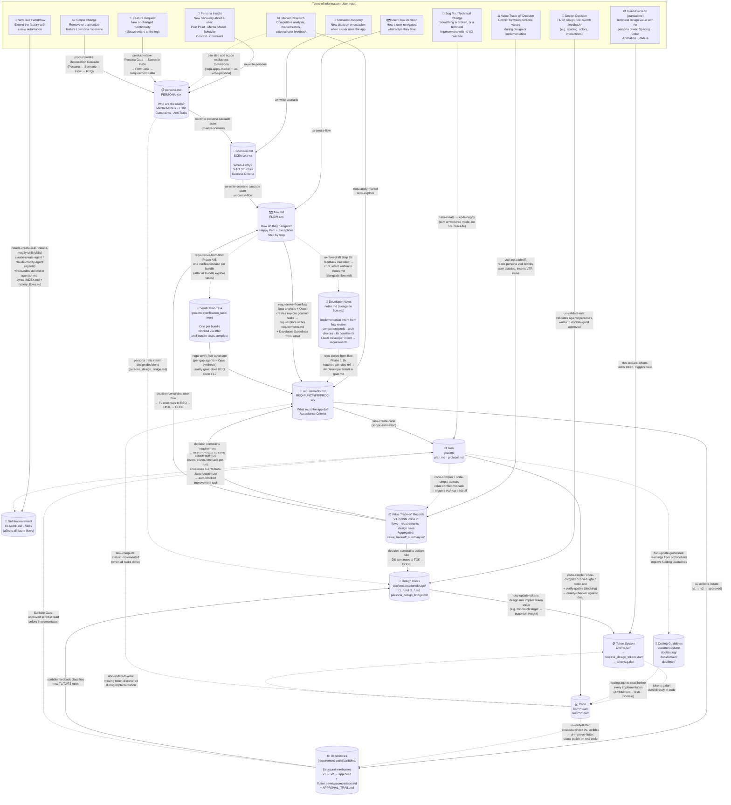

# AI Software Factory — Information Flows

This document shows what types of information can be fed into the system, where each type enters the pipeline, and what path it takes through the project artifacts until it lands in the app.
Note: This document might not be 100% accurate, the skills are single point of truth. 

---

## How the User Feeds Information into the System

The user always talks to Claude Code — that is the system. Claude decides which skill to invoke.

```
Natural language:   "I found out that Persona X..."
                    "Create a new task to achieve goal Y"
                    "We are removing feature Z"

Invoke skill:       "Use product-intake skill"
                    "Use ux-write-persona skill for PERSONA-001"

Execute goal.md:    "Do requirements_tasks/.../goal.md"
                    → task-start validates + gates + marks in_progress → claude-route detects type and invokes the right skill
```

---

## Information Flow Diagram



---

## Which Information Takes Which Path

| Input | Entry point | Required path to app |
|-------|-------------|----------------------|
| Persona Insight | persona.md (via ux-write-persona) | → cascade scan (scenarios + flows) → Requirements → Task → Code |
| Scenario Discovery | scenario.md (via ux-write-scenario) | → cascade scan (flows) → Requirements → Task → Code |
| User Flow Decision | flow.md (via ux-create-flow) | → Requirements (gap analysis) → Verification Gate (requ-verify-flow-coverage) → Task → Code |
| Market Research | requirements.md | → Task → Code *(can also add persona scope exclusions)* |
| Design Decision (rule) | doc/design/*.md (via ux-validate-rule) | → Task → Code |
| UI Scribble | [requirement-path]/scribbles/ (via ui-scribble-iterate) | → Design Rules (T1/T2/T3) → (Scribble Gate) → Task → Code |
| Token Decision (standalone) | tokens.json → tokens.g.dart | → used directly in code |
| Token Decision (persona-driven) | Design Rules → tokens.json → tokens.g.dart | → used directly in code |
| Feature Request | persona.md | → Persona Gate → Scenario → Flow → Requirements → Task → Code |
| Bug Fix / Technical Change | Task (goal.md) | → code-bugfix (slim or worktree mode) → task-complete-bugfix → Code |
| Scope Change | persona.md | → Deprecation Cascade (Scenario → Flow → Requirements) |
| New Skill / Workflow | .claude/skills/ (via claude-create-skill) · .claude/agents/ (via claude-create-agent) | — extends the factory itself |
| Task Ordering Rule Change | `.claude/task_ordering_rules.yaml` (via claude-modify-ordering-rules) | — governs how `next_tasks.py` ranks open tasks; changes take effect immediately on next run |
| Value Trade-off Decision | VTR record inline in Design Rule / Requirement / Flow (via vcd-log-tradeoff) | → artifact continues its normal path: Design Rule → Token → Code; Requirement → Task → Code; Flow → Requirement → Task → Code |

---

## Release Workflow Sequence

The release workflow follows four sequential phases. Run `/release-status` at any time to see which phase you are in and the recommended next step.

| Phase | Skill | What it does |
|-------|-------|-------------|
| A — Requirements | `requ-explore` | Document requirements for the release |
| A — Requirements | `release-plan` | Assign ACs/sections to packages in RELEASE_BACKLOG.md |
| A — Requirements | `requ-derive-from-flow` | *(if needed)* Derive requirements from user flows |
| A — Requirements | `requ-assign-packages` | Bulk-assign `target_package` to unassigned ACs |
| B — Begin Implementation | `release-begin-impl` | Verify requirements ready, set release `active`, create orchestration task |
| C — Autorun | `/autorun` | Iteratively creates impl tasks per package, then executes them |
| D — Release Execution | `release` | Pre-flight → smoke test → merge/tag/push → release notes |

---

## Why This Path?

The pipeline is top-down because each layer justifies the one below it:

- **Personas** justify why scenarios exist
- **Scenarios** justify why user flows are designed the way they are
- **User Flows** reveal which features the app needs → Requirements
- **Requirements** define what must be implemented → Task
- **UI Scribbles** are the structural wireframes that bridge requirements and design rules — approved scribbles gate implementation and can trigger new T1/T2/T3 rules
- **Design Rules** ensure all UI changes are persona-aligned and consistent — and can prescribe concrete values that become tokens (e.g. a motor constraint → minimum touch target → `buttonMinHeight` token)
- **Code** is the end product of all decisions above

Feedback loops keep the system current:
- **Implementation → Guidelines**: Learnings from tasks improve `doc/` for future implementations
- **Sketch Feedback → Design Rules**: New visual decisions are anchored as T1/T2 rules in DS
- **Task-Complete → Requirements**: Status propagation keeps the overview accurate
- **Code → Tokens**: Missing tokens discovered during implementation are added immediately
- **claude-optimize → System**: Event-driven producer — at most one auto-blocked improvement task per run (or a documented no-op). The developer must unblock before any executor picks it up (G-INV-1).
- **claude-create-skill → System**: The user can extend the factory with new automations at any time
- **Verification Gate → Requirements**: After each bundle of exploration tasks completes, the verification task unblocks automatically. `requ-verify-flow-coverage` checks whether the written requirements actually cover the flow gaps — confirmed gaps are remediated, intentional deviations are documented, unresolved conflicts are parked as decisions. This closes the loop between flows and requirements before implementation begins.
- **Task Ordering Rules → Task Queue**: `.claude/task_ordering_rules.yaml` defines how `next_tasks.py` ranks open tasks — layer order, priority boosts, and explicit overrides. Edit via `claude-modify-ordering-rules`; validate with `scripts/task_ordering/validate_rules.py`. `scripts/propose_after.py` suggests `after:` dependencies for new tasks.
- **vcd-log-tradeoff → VTR Records**: When persona values conflict, the decision is documented inline in the artifact where the conflict arose. That artifact then continues its normal path to code — so the decision always reaches the app. The VTR-NNN ID makes it traceable (WHY comments in code can reference it).
